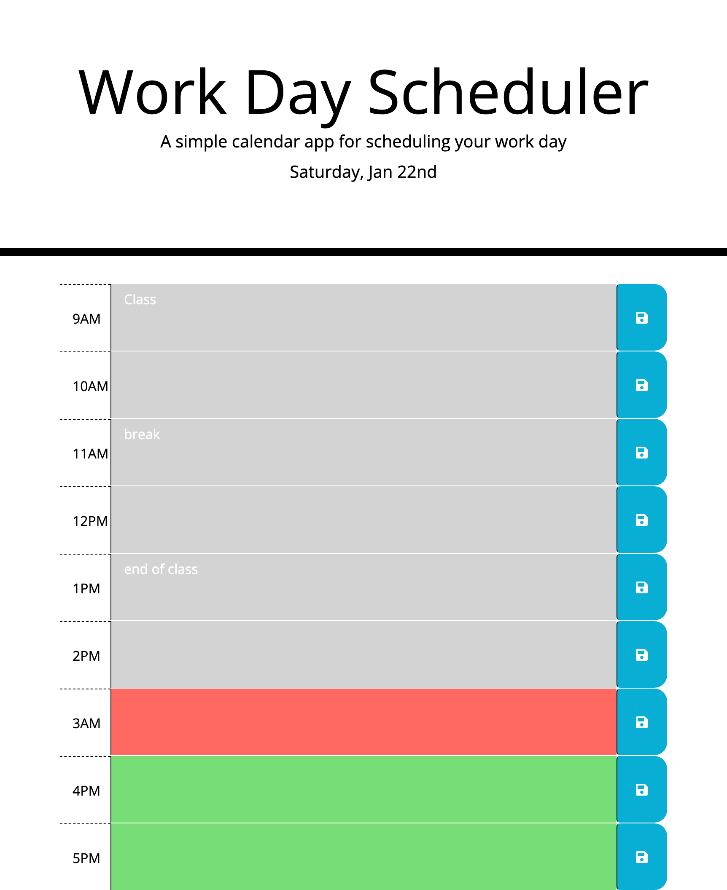

# Work-Day-Scheduler-Project

● First I made a time block for each hour from 9am to 5pm.

● I then made a function for jquery to listen to the documents and added the current day text.

● Then I declared a save btn variable and made a function to grab the id of the hour and text to set to local storage through onclick.

● Then i got all the items by id from local storage and displayed on the text area.

● Lastly depending on current hr of the day I changed the colours by looping over time blocks.

Deployed Link: https://anuur7.github.io/Work-Day-Scheduler-Project/

